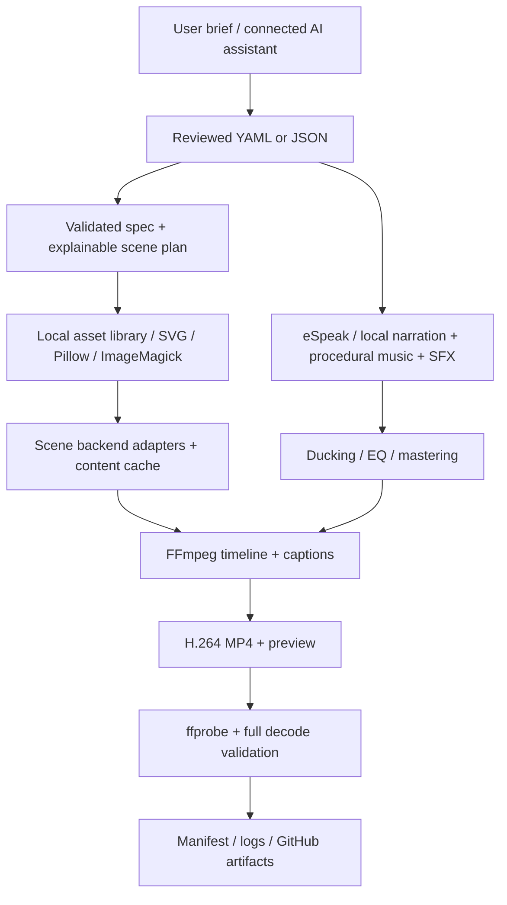

# V / Creator — CPU Video Factory

A local, CLI-first video studio: **brief → reviewed spec → explainable plan → assets → scenes → audio → MP4 → validation**. No GPU, paid API, cloud account or downloaded stock assets are required for the default renderer.

> **الحالة:** مسار CPU الأساسي قابل للتشغيل والاختبار، مع تعليق صوتي محلي وموسيقى ومؤثرات وترجمة. التخطيط باللغة الطبيعية دون API هو قالب أولي؛ يكتب المساعد النص والمشاهد في YAML قبل الإنتاج. المحركات المتقدمة ليست كلها جاهزة: راجع [مصفوفة التنفيذ](docs/status.md).

## What works

- Strict YAML/JSON specs; rejects unsupported fields, unsafe paths, duplicate IDs and invalid durations.
- Intent-based, explainable tool selection; explicit overrides and fail-closed fallback controls.
- FFmpeg CPU H.264 rendering and delivery; Pillow/SVG asset generation; optional ImageMagick normalization.
- Optional **Remotion** React compositions and a software-rendered Chromium adapter.
- eSpeak NG or supplied audio narration; deterministic procedural music and 15 SFX templates.
- EQ, compression, sidechain music ducking, optional short echo/reverb approximation, loudness normalization and limiting.
- SRT/VTT, optional burned captions, embedded MP4 subtitles, conservative cut/dip-to-black transitions.
- Content-addressed scene caching, corruption checks, bounded threads, retries, logs and provenance.
- MP4 full-decode validation, dimensions, FPS, codec, duration, audio sync and subtitle checks.
- GitHub Actions test/render workflows with caching and short-lived artifacts.

**Not a text-to-cinema foundation model.** Procedural visuals are designed templates, local narration sounds synthetic, and semantic planning/fact checking remains the assistant's responsibility. Advanced integrations have explicit readiness labels; see [status](docs/status.md).

## Architecture



## Installation — Ubuntu / Linux, Python 3.11+

```bash
./scripts/install.sh --system
source .venv/bin/activate
video-factory doctor
```

`--system` explicitly invokes apt/sudo for FFmpeg, ImageMagick, eSpeak NG and fonts. Without it, the installer only creates a venv and installs pinned Python dependencies. System packages follow your distro security updates (not byte-for-byte pinned). Rendering itself never installs tools or calls an external provider.

Manual installation:

```bash
sudo apt-get install ffmpeg imagemagick espeak-ng fonts-dejavu-core python3-venv
python3 -m venv .venv
.venv/bin/pip install -e '.[test]'
```

The package is **repository-oriented**: use an editable installation in this checkout; config, brand and backend projects live beside `src/`. A standalone wheel is not yet supported.

### Optional Remotion (Node 22 + Chromium)

First read the [licensing policy](docs/licensing.md). Remotion is **not an unrestricted MIT-style dependency**.

```bash
npm ci
npm run typecheck
# Install a Chromium browser and its OS libraries explicitly using your distribution.
export VF_BROWSER=/absolute/path/to/chromium
# In video.yaml: planner: {enable: [ffmpeg, remotion]}
video-factory doctor
```

No browser download happens implicitly. Use the installed browser through `VF_BROWSER`; the adapter requests software rendering (`swangle`). See [tools](docs/tools.md) for optional Python engines.

## Quick start

```bash
video-factory plan videos/example
video-factory render videos/example --preset draft
video-factory validate videos/example
# Full requested dimensions/FPS:
video-factory render videos/example --preset standard
# Or use wrappers without activating a venv:
./scripts/preview.sh videos/example
```

The included **30-second “How a Black Hole Works”** project renders without APIs. With eSpeak installed it has narration; if not, this example explicitly opts into caption-only fallback, recorded in the manifest. Other projects default to an error if requested TTS is unavailable.

Deliverables in `videos/example/output/`:

```text
final.mp4                   H.264 + AAC, fast-start, embedded subtitles
preview.mp4                 360-wide / 15 FPS small viewing copy
subtitles.srt               estimated phrase captions
subtitles.vtt
production-plan.json
production-manifest.json   source/effective specs, versions, hashes, decisions
validation-report.json     technical checks + ffprobe metadata
render-log.txt              subprocess commands and diagnostics
failure.json               only after a failed render
```

## Natural-language control

Ask your connected assistant to read [AGENTS.md](AGENTS.md), create a factual script and scene plan, then run the CLI. The assistant can edit the complete structured spec; the local CLI is not secretly using a paid LLM.

```bash
video-factory plan "Create a 60-second vertical video about black holes"
video-factory create --topic "Black holes" --duration 60 \
  --width 1080 --height 1920 --project videos/my-black-hole
# Review/edit generated YAML before rendering!
video-factory render videos/my-black-hole --preset draft
```

`plan "brief"` returns a draft spec and tool plan without writing/rendering. `render "brief"` is also supported, but creates a **clearly labeled template video**, not researched narration. Offline parsing extracts a few English/Arabic duration/aspect/topic patterns; it does not understand arbitrary instructions. Structured YAML is the authoritative interface.

## Video spec

```yaml
video:
  id: demo
  title: A clear idea
  duration: 4
  width: 1080
  height: 1920
  fps: 30
audio:
  narration: true
  music: true
  sound_effects: true
  voice: en
planner:
  enable: [ffmpeg]
render:
  preset: standard
  burn_captions: true
scenes:
  - id: opening
    duration: 4
    type: title
    title: Start with a clear idea
    narration: "One clear idea makes a better video."
    transition: fade
    effect: ken_burns
    audio_cues:
      - {time: 0.2, effect: whoosh, duration: 0.5, gain: 0.15}
```

Use `tool: remotion` on a scene to override selection; `allow_fallback: false` makes it mandatory. Set `audio.music: false` to disable music. Every input field is documented by the generated [JSON schema](config/video.schema.json); unknown fields fail, rather than being silently ignored. Durations sum exactly and align to whole frames. Supported presets: draft (max width 360, max 15 FPS), preview (540/24), standard (spec), high (spec, lower CRF). Explicit `--resolution 1080x1920` overrides preset size.

## Repository layout

```text
src/video_factory/   models, CLI, planner, assets, audio, captions, validation
  backends/          FFmpeg, Remotion, MoviePy, Manim adapters
  providers/         guarded optional provider protocol (no cloud integration)
config/              tool registry, reference defaults, JSON schema
brand/               shared raster theme
remotion/            React composition + reusable primitives
manim/               optional conceptual orbit example
motion-canvas/       opt-in authoring template, not an automated backend
videos/example/      YAML, script and ignored generated outputs
scripts/             install, doctor, render, preview, validate, clean, update
.github/workflows/   CI smoke test + workflow_dispatch render
```

## GitHub Actions

After these changes reach your default branch, open **Actions → Render video → Run workflow**. Choose `videos/example`, a preset, optional resolution and whether to retain intermediates. Download the `video-<run-id>` artifact. These workflows use only the default CPU path; Node/Remotion is checked by CI but not required for a normal render. See [Actions guide](docs/github-actions.md).

GitHub Free is **not unlimited compute or storage**. Software licensing, account Actions allowances, runner resources, artifact retention and any optional API charges are separate concerns. Check your account's current usage; no quota assumptions are built in.

## Tests & debugging

```bash
python -m pytest -q
npm ci && npm run typecheck
video-factory doctor
video-factory plan videos/example
./scripts/clean.sh videos/example --yes  # removes work/cache only, keeps sources/output
```

Optional integration tests skip when their dependencies are missing; core smoke tests require FFmpeg/ffprobe. The final manifest records fallbacks, omitted narration and tool versions. On failure inspect `failure.json`, `render-log.txt` and `validation-report.json`. Successful scene caches survive retries. See [troubleshooting](docs/troubleshooting.md).

## Limits and licensing

This release caps synthesis at **10 minutes per render**, processes scenes sequentially with bounded codec threads, and supports image assets (one primary raster per scene) rather than arbitrary footage editing. Caption timing is phrase-estimated, not speech-aligned. LUFS processing is single-pass; no perceptual-quality guarantee or automatic scientific fact-checking. Only cut/fade transitions and a small visual-effects set are implemented. Complex 3D, neural generation and automated Motion Canvas/Godot/Unity exports remain extension work.

Project code: [MIT](LICENSE). Engines, fonts, codecs and supplied/generated assets retain their own licenses. No third-party image/music packs are bundled. **Do not describe all outputs as royalty-free or all tools as free/unlimited.** [Full policy](docs/licensing.md) · [Implementation status & verification](docs/status.md).
